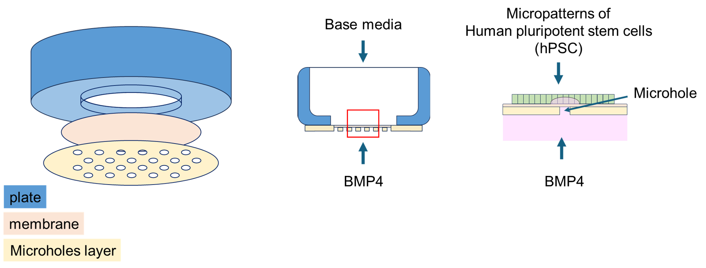

# image_analysis_project

## Introduction

'Micropattern on a membrane' is a local signaling system for in-vitro study of symmetry-breaking events. The system consists of a polystyrene plate with a hole, to which a porous polyester membrane is attached, allowing media to pass from both sides. Another layer with predesigned microholes seals the membrane's pores except for these microholes. On top of each microhole, cells are seeded as micropatterns, ensuring the microhole area is contained within the micropattern area.

This setup allows for the introduction of two types of media to the cells: the upper media, available to all the cells, and the bottom media, available only to the cells on top of the microhole.




## Project goal

In this project, we aimed to study the effect of BMP4 on human pluripotent stem cells (hPSC) using the 'Micropattern on a membrane' system, focusing on the micropattern diameter. hPSCs were exposed to BMP4 in the bottom media for 24 hours, followed by fixation and antibody staining.

## Usage

### Image Analysis

to analyse your images, run the analysis script:

```
python images_analyse.py DIRECTORY NUCLEI MARKER DIAMETER
```

* `DIRECTORY` - directory to the folder of your images
* `NUCLEI` - index of the NUCLEI channel in your images 
* `MARKER` - index of the MARKER channel in your images 
* `DIAMETER` - the microhole diameter. all images in the same folder should be in the same microhole size.

### Plotting Data

To visualize the fraction of positive cells in microholes based on their diameter, use the plot script:

```
python plot_data.py
```
This script utilizes data from `micropattern_analysis.csv` generated by `images_analyse.py`.

### Try It Yourself!

To analyze micropattern images, we provide a folder containing these images. The nuclear channel index is 0, the marker channel index is 2, and the hole diameter is 165 µm. To run the analysis script, use the following command:

```
python images_analyse.py 165um 0 2 165
```

The `micropattern_analysis.csv` used by the `images_analyse.py` script is already filled with data from previous analyses. You can use this CSV file as a source dataset for plotting positive cell fractions across different hole diameters using plot_data.py. To plot the data, simply run:

```
python plot_data.py
```

### input:

**images_analyse.py script:**

* Accepts a directory of micropattern images in .tiff format with dimensions [cyx] (c: channel, y: y-axis, x: x-axis).

**plot_data.py script:**

* Automatically uses micropattern_analysis.csv as its data source.

### output:

**images_analyse.py script**

Generates `micropattern_analysis.csv` with columns:

| total  | positive | hole_diameter | file_path |
| ------ |:--------:| :------------:| :--------:|
| total number of cells | number of positive cells to the marker | diameter of the microhole |path to the analysed image|

* total: Total number of cells.
* positive: Number of positive cells to the marker.
* hole_diameter: Microhole diameter.
* file_path: File path of the analyzed image.


**plot_data.py script**

Produces a `.png` file containing a boxplot showing the fraction of positive cells in microholes across different diameters.
These are the analysis steps to produce this plot:

## Data Processing

### Image Analysis (`images_analyse.py`)

The `images_analyse.py` script processes micropattern images to analyze the presence of cells and their marker expression within microholes. Here's a breakdown of its functionality:

1. **Image Loading and Preprocessing**:
   - The script first loads each image from the specified directory using the `open_image` function. Images are typically in TIFF format and are converted to 8-bit for compatibility with OpenCV.
  
2. **Cell Segmentation**:
   - Using the `segregat_image` function, the script performs cell segmentation on the nuclei channel (index 0). This step identifies and segments individual cells within the image using the Cellpose library.

3. **Marker Thresholding and Counting**:
   - The script calculates the number of positive cells for a specific marker channel (index 2). This is achieved through thresholding and counting cells whose marker expression exceeds a specified threshold.

4. **Data Logging**:
   - For each analyzed image, the script logs the total number of cells, the number of positive cells to the marker, the microhole diameter, and the file path in `micropattern_analysis.csv`.

### Plotting Data (`plot_data.py`)

The `plot_data.py` script visualizes the data collected from `micropattern_analysis.csv`. Here's how it processes the data:

1. **Data Loading**:
   - The script reads `micropattern_analysis.csv` using Pandas, which contains data on cell counts and marker expression for each microhole diameter.

2. **Data Transformation**:
   - It calculates the cell density per µm² (`density = total / 500`) and estimates the total number of cells within the microhole area (`cells in hole area = hole_diameter * density`).

3. **Fraction Calculation**:
   - The script computes the fraction of positive cells within the microhole area (`positive / cells in hole area`), providing insights into marker expression relative to hole diameter.

4. **Plot Generation**:
   - Using Seaborn, the script creates a box plot where the y-axis represents the fraction of positive cells within microholes, and the x-axis represents different hole diameters.

5. **Output**:
   - The resulting box plot is saved as `positive_cells_fraction_boxplot.png` in the project's main directory, offering a visual representation of the data.

## Dependencies

Use the following command to install the required dependencies:
```
pip install -r requirements.txt
```

## Test the program:
Test the program using pytest:
```
pytest
```

## Acknowledgment

This project was originally implemented as part of the [Python programming course](https://github.com/szabgab/wis-python-course-2024-04) at the [Weizmann Institute of Science](https://www.weizmann.ac.il/) taught by [Gabor Szabo](https://szabgab.com/).